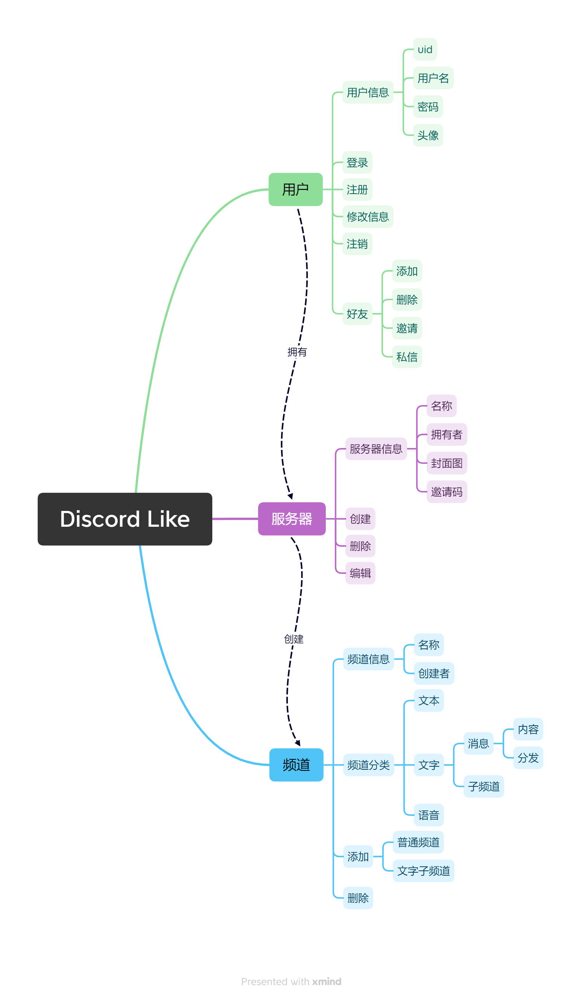
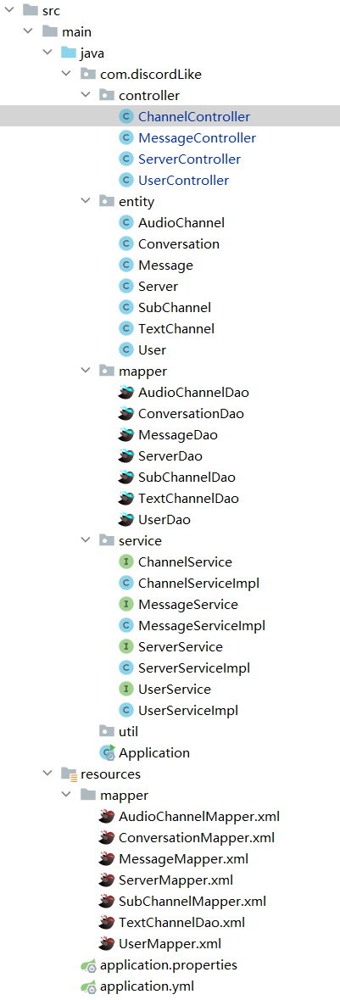
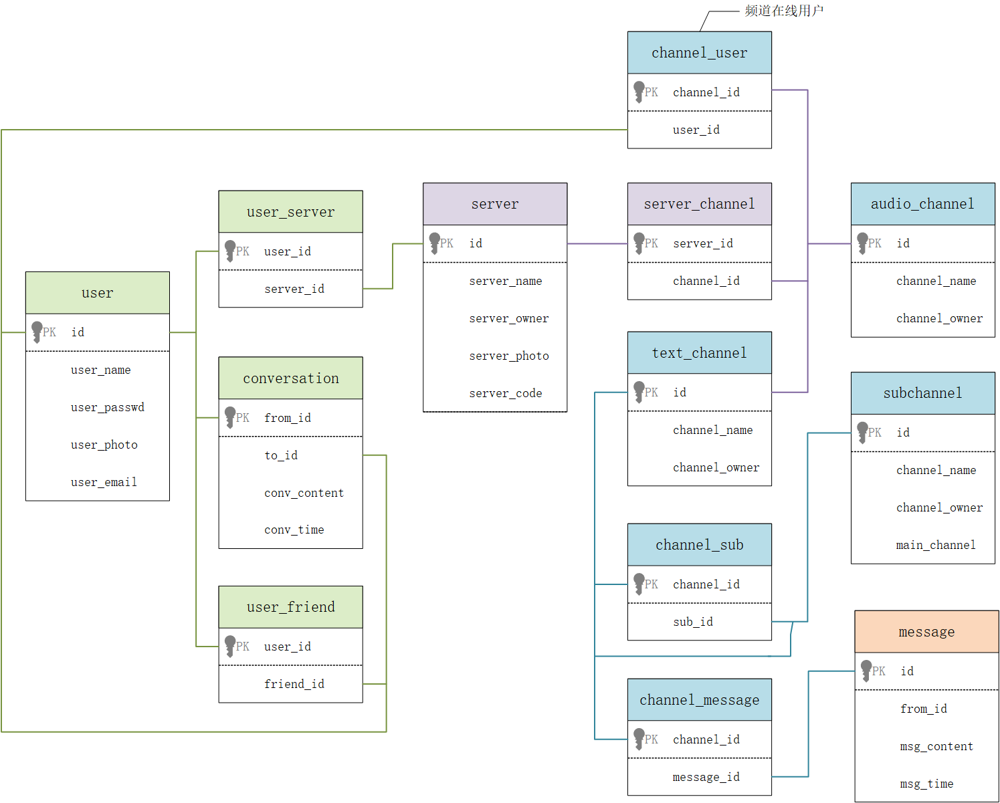

## 项目分析

## 技术方案

- 开发环境：IntelliJ IDEA 2022
- 服务器环境：阿里云轻量云服务，2核4G，Alibaba Cloud Linux
- 部署应用：Tomcat 9.0.30
- 开发模式：前后端分离
- API文档：[API List](https://github.com/Ayin-cc/DiscordLike/blob/dev/API%20List.md)
- 前端：HTML + CSS + JS + jquery
- 后端：Java Spring Boot + MyBatis
- JDK版本：17
- 数据库：MySQL

### 后端结构

### 数据库结构

### 不足

- 服务器日志系统未完善
